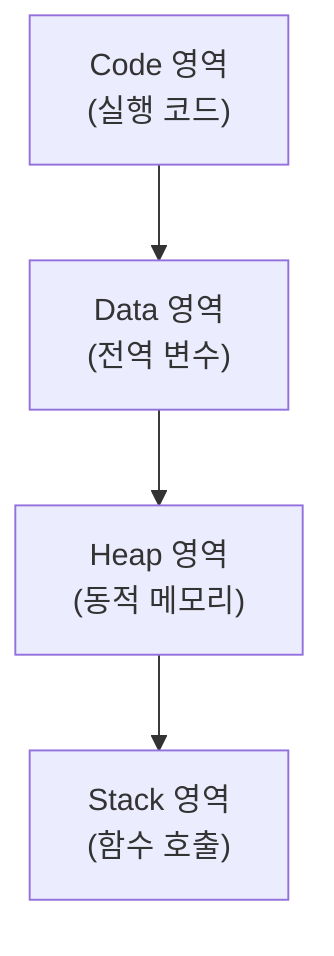
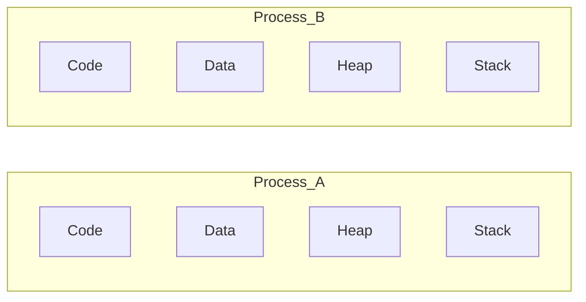
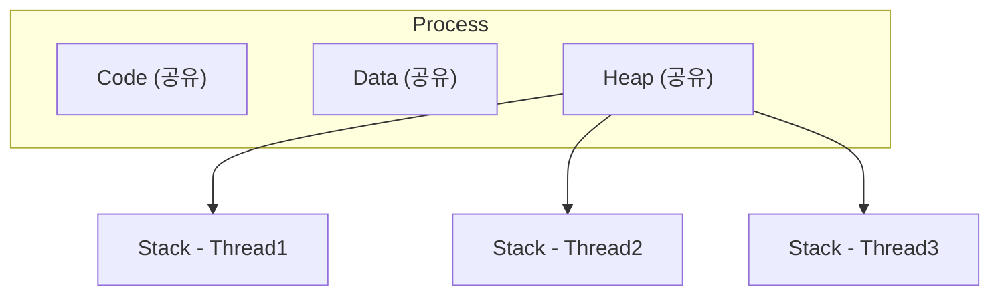

개발을 하다 보면 **프로세스(Process)** 와 **스레드(Thread)** 라는 용어를 자주 접하게 된다.
많은 개발자가 아래처럼만 이해하는 경우가 많다.

프로세스 = 프로그램 실행 단위
스레드 = 작업 실행 단위

하지만 실제 차이를 이해하려면 **메모리 구조**를 중심으로 보는 것이 가장 중요하다.
이번 글에서는 **프로세스와 스레드의 차이를 메모리 구조 중심으로 설명**한다.

---

# 1. 프로세스(Process)란

프로세스는 **실행 중인 프로그램**을 의미한다.

예를 들어

- 크롬 실행
- 카카오톡 실행
- VSCode 실행

각각 하나의 **프로세스**다.
운영체제는 프로그램을 실행하면 **독립적인 메모리 공간을 할당**한다.

---

# 2. 프로세스 메모리 구조

프로세스는 아래와 같은 메모리 구조를 가진다.



---

# 3. 프로세스의 특징

프로세스의 가장 중요한 특징은 메모리 독립성이다.
즉 프로세스는 서로 메모리를 공유하지 않는다.



장점
- 안정성이 높다
- 하나의 프로세스 오류가 다른 프로세스에 영향이 없다

단점
- 프로세스 생성 비용이 크다

---

# 4. 스레드(Thread)란

스레드는 프로세스 내부에서 실행되는 작업 단위다.

예를 들어 웹 서버가 요청을 처리할 때

```text
요청1 → Thread1
요청2 → Thread2
요청3 → Thread3
```

처럼 동시에 작업을 처리할 수 있다.

---

# 5. 스레드 메모리 구조

스레드는 프로세스 내부에서 생성되기 때문에 일부 메모리를 공유한다.

- Code / Data / Heap → 공유
- Stack → 스레드마다 별도



장점
- 생성 비용이 낮다.

---

# 6. 스레드의 문제점

스레드는 하나의 프로세스 내에서 **Code, Data, Heap 메모리를 공유**하기 때문에 성능 면에서는 효율적이지만 다음과 같은 문제가 발생할 수 있다.

- **Race Condition** (경쟁 상태) : 여러 스레드가 **동시에 동일한 데이터를 수정**하면 데이터가 예상과 다르게 변경될 수 있다.
- **Deadlock** (교착 상태) : 두 개 이상의 스레드가 서로가 가진 자원을 기다리면서 **영원히 실행되지 않는 상태**를 말한다.

스레드는 성능 향상에 유리하지만 동기화 문제, 데드락, 자원 경쟁 등의 문제가 발생할 수 있다.  
이러한 문제를 해결하기 위한 다양한 기법들이 존재하지만, 해당 내용은 별도의 글에서 자세히 다루도록 하겠다.

---

# 7. 한눈에 보는 차이
| 구분    | 프로세스   | 스레드    |
| ----- | ------ | ------ |
| 실행 단위 | 프로그램   | 작업     |
| 메모리   | 독립     | 공유     |
| 생성 비용 | 높음     | 낮음     |
| 안정성   | 높음     | 낮음     |
| 통신    | IPC 필요 | 메모리 공유 |
